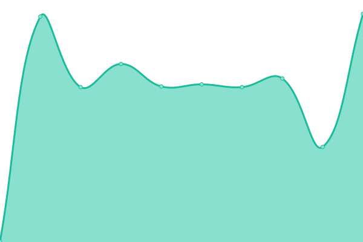
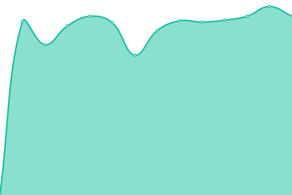
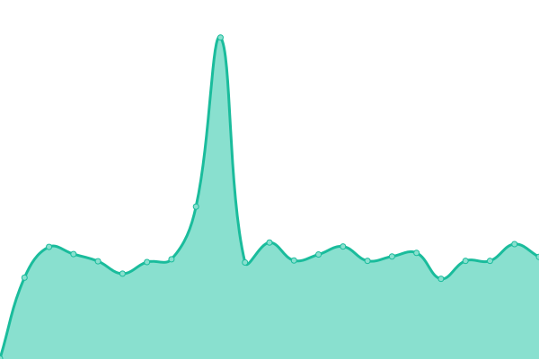

# [📈 Live Status](https://KMHARS.github.io/uptime): <!--live status--> **🟩 All systems operational**

This repository contains the open-source uptime monitor and status page for [KMHARS](https://KMHARS.github.io/uptime), powered by [Upptime](https://github.com/upptime/upptime).

With [Upptime](https://upptime.js.org), you can get your own unlimited and free uptime monitor and status page, powered entirely by a GitHub repository. We use [Issues](https://github.com/KMHARS/uptime/issues) as incident reports, [Actions](https://github.com/KMHARS/uptime/actions) as uptime monitors, and [Pages](https://KMHARS.github.io/uptime) for the status page.

<!--start: status pages-->
<!-- This summary is generated by Upptime (https://github.com/upptime/upptime) -->
<!-- Do not edit this manually, your changes will be overwritten -->
<!-- prettier-ignore -->
| URL | Status | History | Response Time | Uptime |
| --- | ------ | ------- | ------------- | ------ |
|  [KMHARS Main Internet](hfj094ec6hm.sn.mynetname.net) | 🟩 Up | [kmhars-main-internet.yml](https://github.com/KMHARS/uptime/commits/HEAD/history/kmhars-main-internet.yml) | 

 246ms
     
 | 

<a href="https://kmhars.github.io/uptime/history/kmhars-main-internet">98.14%</a>
    

|  [KMHARS Backup Internet](hdh08hzryd0.sn.mynetname.net) | 🟩 Up | [kmhars-backup-internet.yml](https://github.com/KMHARS/uptime/commits/HEAD/history/kmhars-backup-internet.yml) | 

 258ms
     
 | 

<a href="https://kmhars.github.io/uptime/history/kmhars-backup-internet">100.00%</a>
    

|  [KMHARS Makati Datacenter / Facebook Cache](103.190.139.186) | 🟩 Up | [kmhars-makati-datacenter-facebook-cache.yml](https://github.com/KMHARS/uptime/commits/HEAD/history/kmhars-makati-datacenter-facebook-cache.yml) | 

 579ms
     
 | 

<a href="https://kmhars.github.io/uptime/history/kmhars-makati-datacenter-facebook-cache">98.34%</a>
    

|  [KMHARS Website](https://kmhars.com) | 🟩 Up | [kmhars-website.yml](https://github.com/KMHARS/uptime/commits/HEAD/history/kmhars-website.yml) | 

 1342ms
     
 | 

<a href="https://kmhars.github.io/uptime/history/kmhars-website">100.00%</a>
    

|  [KMHARS Speedtest Server / Marawi Main Fiber](kmhars.ookla.databyte-network.com) | 🟩 Up | [kmhars-speedtest-server-marawi-main-fiber.yml](https://github.com/KMHARS/uptime/commits/HEAD/history/kmhars-speedtest-server-marawi-main-fiber.yml) | 

 277ms
     
 | 

<a href="https://kmhars.github.io/uptime/history/kmhars-speedtest-server-marawi-main-fiber">98.35%</a>
    

<!--end: status pages-->

[**Visit our status website →**](https://KMHARS.github.io/uptime)

## 📄 License

- Powered by: [Upptime](https://github.com/upptime/upptime)
- Code: [MIT](./LICENSE) © [Anand Chowdhary](https://anandchowdhary.com), supported by [Pabio](https://pabio.com)
- Data in the `./history` directory: [Open Database License](https://opendatacommons.org/licenses/odbl/1-0/)
