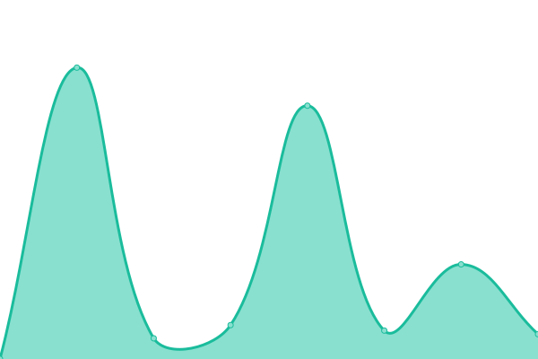

# [📈 Live Status](https://KMHARS.github.io/uptime): <!--live status--> **🟧 Partial outage**

This repository contains the open-source uptime monitor and status page for [KMHARS](https://KMHARS.github.io/uptime), powered by [Upptime](https://github.com/upptime/upptime).

With [Upptime](https://upptime.js.org), you can get your own unlimited and free uptime monitor and status page, powered entirely by a GitHub repository. We use [Issues](https://github.com/KMHARS/uptime/issues) as incident reports, [Actions](https://github.com/KMHARS/uptime/actions) as uptime monitors, and [Pages](https://KMHARS.github.io/uptime) for the status page.

<!--start: status pages-->
<!-- This summary is generated by Upptime (https://github.com/upptime/upptime) -->
<!-- Do not edit this manually, your changes will be overwritten -->
<!-- prettier-ignore -->
| URL | Status | History | Response Time | Uptime |
| --- | ------ | ------- | ------------- | ------ |
|  [KMHARS Main Fiber Line](het09022amj.sn.mynetname.net) | 🟩 Up | [kmhars-main-fiber-line.yml](https://github.com/KMHARS/uptime/commits/HEAD/history/kmhars-main-fiber-line.yml) | 

 262ms
     
 | 

<a href="https://KMHARS.github.io/uptime/history/kmhars-main-fiber-line">99.57%</a>
    

|  [KMHARS Main Internet (D)](hf60936b8q0.sn.mynetname.net) | 🟩 Up | [kmhars-main-internet-d.yml](https://github.com/KMHARS/uptime/commits/HEAD/history/kmhars-main-internet-d.yml) | 

 277ms
     
 | 

<a href="https://KMHARS.github.io/uptime/history/kmhars-main-internet-d">99.77%</a>
    

|  [KMHARS Backup Internet (G)](hdh08hzryd0.sn.mynetname.net) | 🟩 Up | [kmhars-backup-internet-g.yml](https://github.com/KMHARS/uptime/commits/HEAD/history/kmhars-backup-internet-g.yml) | 

 586ms
     
 | 

<a href="https://KMHARS.github.io/uptime/history/kmhars-backup-internet-g">99.60%</a>
    

|  [KMHARS Backup Internet 2 (P)](hfj094ec6hm.sn.mynetname.net) | 🟩 Up | [kmhars-backup-internet-2-p.yml](https://github.com/KMHARS/uptime/commits/HEAD/history/kmhars-backup-internet-2-p.yml) | 

 235ms
     
 | 

<a href="https://KMHARS.github.io/uptime/history/kmhars-backup-internet-2-p">100.00%</a>
    

|  [KMHARS Makati Datacenter / Facebook Cache](103.190.139.4) | 🟩 Up | [kmhars-makati-datacenter-facebook-cache.yml](https://github.com/KMHARS/uptime/commits/HEAD/history/kmhars-makati-datacenter-facebook-cache.yml) | 

 241ms
     
 | 

<a href="https://KMHARS.github.io/uptime/history/kmhars-makati-datacenter-facebook-cache">96.62%</a>
    

|  [KMHARS Website](https://kmhars.com) | 🟩 Up | [kmhars-website.yml](https://github.com/KMHARS/uptime/commits/HEAD/history/kmhars-website.yml) | 

 1360ms
     
 | 

<a href="https://KMHARS.github.io/uptime/history/kmhars-website">100.00%</a>
    

|  [KMHARS Speedtest Server](kmhars.ookla.databyte-network.com) | 🟩 Up | [kmhars-speedtest-server.yml](https://github.com/KMHARS/uptime/commits/HEAD/history/kmhars-speedtest-server.yml) | 

 240ms
     
 | 

<a href="https://KMHARS.github.io/uptime/history/kmhars-speedtest-server">99.80%</a>
    

|  [Google](https://google.com) | 🟩 Up | [google.yml](https://github.com/KMHARS/uptime/commits/HEAD/history/google.yml) | 

 215ms
     
 | 

<a href="https://KMHARS.github.io/uptime/history/google">100.00%</a>
    

|  [Facebook](https://facebook.com) | 🟩 Up | [facebook.yml](https://github.com/KMHARS/uptime/commits/HEAD/history/facebook.yml) | 

 577ms
     
 | 

<a href="https://KMHARS.github.io/uptime/history/facebook">100.00%</a>
    

|  [Globe](https://globe.com.ph) | 🟥 Down | [globe.yml](https://github.com/KMHARS/uptime/commits/HEAD/history/globe.yml) | 

 0ms
     
 | 

<a href="https://KMHARS.github.io/uptime/history/globe">0.00%</a>
    

|  [Smart](https://smart.com.ph) | 🟩 Up | [smart.yml](https://github.com/KMHARS/uptime/commits/HEAD/history/smart.yml) | 

 1171ms
     
 | 

<a href="https://KMHARS.github.io/uptime/history/smart">100.00%</a>
    

|  [PLDT](https://pldthome.com) | 🟩 Up | [pldt.yml](https://github.com/KMHARS/uptime/commits/HEAD/history/pldt.yml) | 

 2628ms
     
 | 

<a href="https://KMHARS.github.io/uptime/history/pldt">99.75%</a>
    

|  [Mobile Legends](https://m.mobilelegends.com) | 🟩 Up | [mobile-legends.yml](https://github.com/KMHARS/uptime/commits/HEAD/history/mobile-legends.yml) | 

 1450ms
     
 | 

<a href="https://KMHARS.github.io/uptime/history/mobile-legends">100.00%</a>
    

|  [PUBG](https://pubg.com) | 🟩 Up | [pubg.yml](https://github.com/KMHARS/uptime/commits/HEAD/history/pubg.yml) | 

 407ms
     
 | 

<a href="https://KMHARS.github.io/uptime/history/pubg">100.00%</a>
    

<!--end: status pages-->

[**Visit our status website →**](https://KMHARS.github.io/uptime)

## 📄 License

- Powered by: [Upptime](https://github.com/upptime/upptime)
- Code: [MIT](./LICENSE) © [Anand Chowdhary](https://anandchowdhary.com), supported by [Pabio](https://pabio.com)
- Data in the `./history` directory: [Open Database License](https://opendatacommons.org/licenses/odbl/1-0/)
